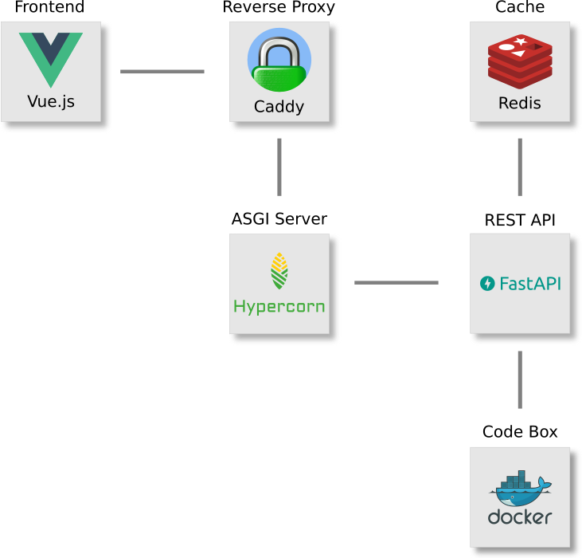

Descrição
=========

O projeto `Code Lab`_ permite programar diretamente pelo navegador,
sem nenhuma outra dependência externa.
É interessante para os casos em que se quer fazer um experimento rápido
mas não há um computador com a linguagem instalada e configurada por perto.

Esse projeto foi feito originalmente como uma prova de conceito
e também ajudar meus alunos a usarem diferentes linguagens de programação
sem a necessidade de instalar nada na máquina deles.

Funcionamento
=============

A execução de um código de fonte desconhecida traz riscos à segurança
porque um código malicioso pode tentar tomar o controle do sistema,
acessar áreas e dados restritos ou fazer mau uso de recursos disponíveis
(memória, processos, disco etc.).
A forma de mitigar esse risco é executando o código em um **sandbox**,
que é um tipo de virtualização de um ambiente restrito e controlado [1]_.

No `Code Lab`_,
o *sandbox* é baseado em um *container* Docker denominado de Codebox_,
que contém com todas as linguagens, bibliotecas e ferramentas oferecidas pelo :code:`Code Lab`,
mas que roda com limitações de permissões de usuário, tempo, memória e restrição de acesso à rede.
Mesmo que haja uma violação,
seus efeitos serão contidos e depois eliminados quando o *container* for destruído.

A comunicação é feita através da entrada e saída padrões :code:`stdin` e :code:`stdout` do :code:`Codebox`.
Os arquivos do projeto, dados de entrada e os comandos a serem executados são enviados pelo :code:`stdin`.
A saída (:code:`stdout`) e os erros (:code:`stderr`) dos comandos
são agrupados e devolvidos pelo :code:`stdout` do :code:`Codebox`.

.. referência para o arquivo no GitHub com os modelos
   ou por o arquivo Python aqui?

.. image:: frontend/src/assets/images/codebox-operation.png

Os modelos usados para troca de informações estão especificados no arquivo :code:`backend/app/models.py`.

Arquitetura
===========

O Codebox_ é a parte mais importante mas não funciona sozinho:
Tudo começa com a aplicação web, que segue o padrão SPA_ (*Single Page Application*)
e é construída com Vue.js_.
O *backend* está hospedado em um *droplet* do :code:`DigitalOcean`.
A aplicação é servida através de um *proxy* reverso pelo Caddy_
e de um servidor Hypercorn_, que usa o padrão `ASGI (Asynchronous Server Gateway Interface)`_,
e serve a aplicação feita com FastAPI_.

A execução dos projetos não é imediata.
Primeiro é feita uma verificação no *cache* (Redis_)
e só se não estiver lá é que o projeto é executado no :code:`Codebox`.

Versão Anterior
===============

A primeira versão deste projeto foi lançada em 2015.
Era uma aplicação :code:`MPA` (*Multiple-Page Application*)
baseada em :code:`Javascript` e :code:`JQuery` no *frontend*.
No *backend*, usava :code:`NGinX` de servidor web,
:code:`GUnicorn` como servidor :code:`WSGI`,
:code:`Flask` de *framework web*, :code:`Redis` para *cache*
e :code:`Docker` como *sandbox*.

Desde então, muita coisa mudou:

* Agora é mais fácil separar o *frontend* do *backend* com *frameworks*
  para construção de aplicações SPA_ (*Single Page Application*) tais como Vue.js_ e React_.
  Estes *frameworks* tornaram o *frontend* mais robusto e o *backend* bem mais enxuto,
  composto basicamente de uma :code:`REST API` para troca de informações.
* No *backend*,
  os *frameworks web* para :code:`Python` mais modernos tal como o FastAPI_ usam programação assíncrona,
  aumentando a capacidade de processamento e a eficiência do uso do servidor.
* E o :code:`CSS3` também evoluiu com novas estruturas tais como o modelo Flexbox_ e `Grid Layout`_.

A atualização do projeto levou a grandes mudanças.
Praticamente, apenas a ideia permaneceu a mesma pois todo o resto foi alterado,
inclusive a funcionalidade do :code:`Codebox`,
que foi bastante simplificada para permitir executar
projetos com diferentes estruturas e comandos.

.. note::

    Devido a essas mudanças no :code:`Codebox`,
    o número de linguagens disponíveis ainda é reduzido (apenas :code:`Python` por enquanto)
    mas será ampliado nas próximas versões em breve.

Código *Open Source*
====================

O código-fonte dos projetos do `Code Lab`_ e :code:`Codebox`
estão disponíveis no :code:`GitHub` em [2]_ e [3]_.
Começaram como dois projetos distintos,
depois eu juntei o projeto do :code:`Codebox` no repositório do :code:`Code Lab`,
mas serão separados novamente, em breve, porque terão caminhos diferentes:
o :code:`Codebox` vai ser desenvolvimento como um microsserviço
para ser usado independentemente do :code:`Code Lab`.

.. note::

    Se você reparar, verá arquivos como :code:`.hgignore` e :code:`.hgtags` no repositório.
    Isso significa que eu uso o Mercurial_ como controle de versão dos meus projetos pessoais
    apesar de hospedá-los no :code:`GitHub`.

Referências
===========

.. [1] Sandbox (computer security): https://en.wikipedia.org/wiki/Sandbox_(computer_security)
.. [2] Repositório do Code Lab: https://github.com/andredias/codelab
.. [3] Repositório do Codebox: https://github.com/andredias/Codebox

.. _ASGI (Asynchronous Server Gateway Interface): https://asgi.readthedocs.io/en/latest/introduction.html
.. _Caddy: https://caddyserver.com/
.. _Code Lab: https://codelab.pronus.io
.. _Codebox: https://github.com/andredias/Codebox
.. _FastAPI: https://fastapi.tiangolo.com/
.. _Flexbox: https://css-tricks.com/snippets/css/a-guide-to-flexbox/
.. _Grid Layout: https://css-tricks.com/snippets/css/complete-guide-grid/
.. _Hypercorn: https://pgjones.gitlab.io/hypercorn/
.. _Mercurial: https://www.mercurial-scm.org/
.. _React: https://reactjs.org/
.. _Redis: https://redis.io/
.. _SPA: https://en.wikipedia.org/wiki/Single-page_application
.. _Vue.js: https://v3.vuejs.org/
