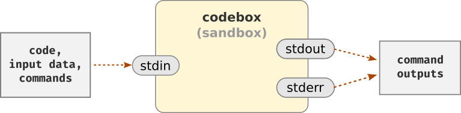

Description
===========

The `Code Lab`_ project allows you to program directly from the browser,
without any other external dependency.
It is interesting for cases where you want to do a quick experiment
but there is no computer with the language installed and configured nearby.

This project was originally made as a proof of concept
and also to help my students to use different programming languages
without needing to install anything on their machines.

Operation
=========

Running code from an unknown source poses security risks
because malicious code can try to take control of the system,
access restricted areas and data or misuse available resources
(memory, processes, disk, etc.).
The way to mitigate those risks is to run the code in a *sandbox*,
which is a type of virtualization of a restricted and controlled environment [1]_.

In the `Code Lab`_,
the *sandbox* is based on a container Docker called Codebox_,
which contains all the languages, libraries and tools offered by :code:`Code Lab`,
but that runs with limitations on user permissions, time, memory and network access restriction.
Even if there is a security breach,
its effects will be contained and then eliminated when the container is destroyed.

Communication is done through :code:`Codebox`'s standard input (:code:`stdin`) and standard output (:code:`stdout`).
The project files, input data and the commands to be executed are sent to :code:`stdin`.
The output (:code:`stdout`) and errors (:code:`stderr`) of the commands
are grouped and returned from :code:`Codebox`'s :code:`stdout`.

The models used to exchange information are specified in the file :code:`backend/app/models.py`.

Architecture
============

Codebox_ is the most important part, but it doesn't work alone:
It all starts with the web application, which follows the SPA_ standard (Single Page Application)
and is built with Vue.js_.
The backend is hosted in a droplet of :code:`DigitalOcean`.
The application is served through a reverse proxy by Caddy_
and a Hypercorn_ server, which uses the `ASGI (Asynchronous Server Gateway Interface)`_ standard,
and serves the application built with FastAPI_.

The execution of the projects is not immediate.
First, a check is made in the cache (Redis_)
and only if it is not there, the project is executed in :code:`Codebox`.

.. image:: frontend/src/assets/images/codelab_codebox_v2.png

Previous version
================

The first version of this project was launched in 2015.
It was an application :code:`MPA` (Multiple-Page Application)
based on :code:`Javascript` and :code:`JQuery` in frontend.
In the backend, used :code:`NGinX` from web server,
:code:`GUnicorn` as a server :code:`WSGI`,
:code:`Flask` ​​from web framework, :code:`Redis` to cache
and :code:`Docker` as sandbox.

Since then, a lot has changed:

* It is now easier to separate the frontend from the backend with SPA_ frameworks such as Vue.js_ and React_.
  These frameworks made the frontend more robust and the backend much leaner,
  basically composed of :code:`REST API` to exchange information.
* In the backend,
  the most modern :code:`Python` web frameworks such as FastAPI_ use asynchronous programming,
  increasing the processing power and efficiency of using the server.
* And :code:`CSS3` has also evolved with new structures such as the Flexbox_ model and `Grid Layout`_.

The update of the project led to major changes.
Practically, only the idea remained the same because everything else was changed,
including :code:`Codebox` functionality,
which has been greatly simplified to allow running
projects with different structures and commands.

.. note::

    Due to these changes in :code:`Codebox`,
    the number of available languages ​​is still reduced (only :code:`Python` for now)
    but it will be expanded in the next versions soon.

Open Source Code
================

The source code of the `Code Lab`_ projects :code:`Codebox`
are available at :code:`GitHub` in [2] _ and [3] _.
They started out as two separate projects,
then I joined the :code:`Codebox` project in the :code:`Code Lab` repository,
but they will be separated again, soon, because they will have different paths:
o :code:`Codebox` will be developed as a microservice
to be used independently of :code:`Code Lab`.

.. note ::

    If you notice, you will see files like :code:`.hgignore` and :code:`.hgtags` in the repository.
    This means that I use Mercurial_ as a version control for my personal projects
    despite hosting them on :code:`GitHub`.

References
===========

.. [1] Sandbox (computer security): https://en.wikipedia.org/wiki/Sandbox_(computer_security)
.. [2] Code Lab repository: https://github.com/andredias/codelab
.. [3] Codebox repository: https://github.com/andredias/Codebox

.. _ASGI (Asynchronous Server Gateway Interface): https://asgi.readthedocs.io/en/latest/introduction.html
.. _Caddy: https://caddyserver.com/
.. _Code Lab: https://codelab.pronus.io
.. _Codebox: https://github.com/andredias/Codebox
.. _FastAPI: https://fastapi.tiangolo.com/
.. _Flexbox: https://css-tricks.com/snippets/css/a-guide-to-flexbox/
.. _Grid Layout: https://css-tricks.com/snippets/css/complete-guide-grid/
.. _Hypercorn: https://pgjones.gitlab.io/hypercorn/
.. _Mercurial: https://www.mercurial-scm.org/
.. _React: https://reactjs.org/
.. _Redis: https://redis.io/
.. _SPA: https://en.wikipedia.org/wiki/Single-page_application
.. _Vue.js: https://v3.vuejs.org/
