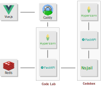

Overview
========

The `Code Lab`_ project allows you to program directly from the browser,
without any other external dependency.
It is interesting for cases where you want to do a quick experiment
but there is no computer with the language installed and configured nearby.

This project was originally made as a proof of concept
and also to help my students use different programming languages
without needing to install anything on their machines.

How to Test It Locally
======================

1. run ``make dev`` to start the backend and frontend servers
2. open https://localhost in your browser

To see the backend API documentation, open ``https://localhost/api/docs`` in your browser.

How It Works?
=============

Running code from an unknown source poses security risks
because a malicious piece of code can try to take control of the system,
access restricted areas and data or misuse available resources
(memory, processes, disk, etc.).
The way to mitigate those risks is to run the code in a *sandbox*,
which is a type of virtualization of a restricted and controlled environment [1]_.

In the `Code Lab`_,
the *sandbox* is based on a container Docker called Codebox_,
which contains all the languages, libraries and tools offered by :code:`Code Lab`,
but that runs with limitations on user permissions, time, memory and network access.
Even if there is a security breach,
its effects will be contained and then eliminated when the container is destroyed.

The models used to exchange information are specified in the file :code:`backend/app/models.py`.

Architecture
============

Codebox_ is the most important part, but it doesn't work alone:
It all starts with the web application, which follows the SPA_ standard (Single Page Application)
and is built with `Vue.js`_.
The backend is hosted in a droplet of :code:`DigitalOcean`.
The application is served through a reverse proxy by Caddy_ and a Hypercorn_ server,
which uses the `ASGI (Asynchronous Server Gateway Interface)`_ standard,
and serves the application built with FastAPI_.

The execution of the projects is not immediate.
First, a check is made in the cache (Redis_)
and only if it is not there, the project is executed in :code:`Codebox`.

Contributing to The Project
===========================

In order to contribute to the project or to try it out from your local machine,
read `CONTRIBUTING.rst <CONTRIBUTING.rst>`_.

References
===========

.. [1] Sandbox (computer security): https://en.wikipedia.org/wiki/Sandbox_(computer_security)

.. _ASGI (Asynchronous Server Gateway Interface): https://asgi.readthedocs.io/en/latest/introduction.html
.. _Caddy: https://caddyserver.com/
.. _Code Lab: https://codelab.pronus.io
.. _Codebox: https://github.com/andredias/Codebox
.. _FastAPI: https://fastapi.tiangolo.com/
.. _Flexbox: https://css-tricks.com/snippets/css/a-guide-to-flexbox/
.. _Grid Layout: https://css-tricks.com/snippets/css/complete-guide-grid/
.. _Hypercorn: https://pgjones.gitlab.io/hypercorn/
.. _Mercurial: https://www.mercurial-scm.org/
.. _React: https://reactjs.org/
.. _Redis: https://redis.io/
.. _SPA: https://en.wikipedia.org/wiki/Single-page_application
.. _Vue.js: https://v3.vuejs.org/
